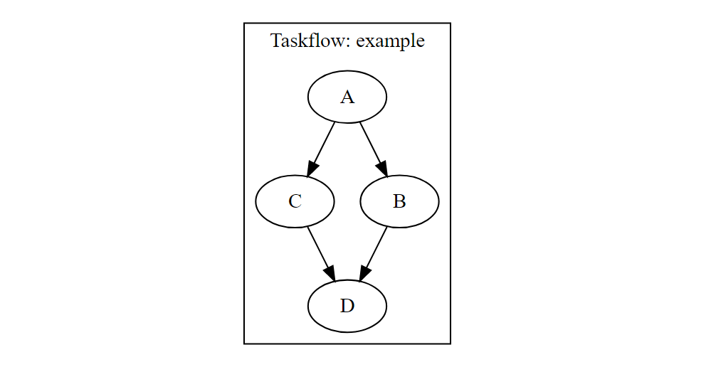

# cpptf

[](https://github.com/ShotaOchi/cpptf/actions)
[](https://cran.r-project.org/package=cpptf)
[](https://opensource.org/licenses/MIT)

## About

cpptf provides Taskflow header files for R users.

Taskflow is a modern header-only C++ parallel task programming library, [https://github.com/taskflow/taskflow](https://github.com/taskflow/taskflow). 

Taskflow helps us to quickly write parallel and heterogeneous programs with high performance scalability and simultaneous high productivity.

See [https://taskflow.github.io/taskflow/](https://taskflow.github.io/taskflow/) for more information about Taskflow.

## Installation
You can install cpptf from GitHub.

Run the following R code to install cpptf.
```r
# install from GitHub
devtools::install_github("ShotaOchi/cpptf")
```

## Usage

### How to use Taskflow in sourceCpp function of Rcpp

1. Include -pthread in PKG_CPPFLAGS and PKG_LIBS.
1. Write **// [[Rcpp::plugins(cpp17)]]** and **// [[Rcpp::depends(cpptf)]]** in your code.
1. Include Taskflow header file and Rcpp header file.

### How to use Taskflow in your R package

1. Add **cpptf** and **Rcpp** to Imports fields and LinkingTo fields.
1. Write **CXX_STD = CXX17**, **PKG_CPPFLAGS = -pthread**, and **PKG_LIBS = -pthread** in src/Makevars.
1. Write **CXX_STD = CXX17**, **PKG_CPPFLAGS = $(SHLIB_PTHREAD_FLAGS)**, and **PKG_LIBS = $(SHLIB_PTHREAD_FLAGS)** in src/Makevars.win.
1. Include Taskflow header file and Rcpp header file.

## Example
A simple example is shown below.
```
library(Rcpp)
Sys.setenv("PKG_CPPFLAGS"="-pthread")
Sys.setenv("PKG_LIBS"="-pthread")

sourceCpp(code = '

// [[Rcpp::plugins(cpp17)]]
// [[Rcpp::depends(cpptf)]]

#include <Rcpp.h>
#include <taskflow/taskflow.hpp>

// [[Rcpp::export]]
void test()
{
  tf::Executor executor;
  tf::Taskflow taskflow;
  auto [A, B, C, D] = taskflow.emplace(
    [] () { Rcpp::Rcout << "TaskA "; },              //  task dependency graph
    [] () { Rcpp::Rcout << "TaskB "; },              // 
    [] () { Rcpp::Rcout << "TaskC "; },              //          +---+          
    [] () { Rcpp::Rcout << "TaskD "; }               //    +---->| B |-----+   
  );                                                 //    |     +---+     |
                                                     //  +---+           +-v-+ 
  A.precede(B);  // A runs before B                  //  | A |           | D | 
  A.precede(C);  // A runs before C                  //  +---+           +-^-+ 
  B.precede(D);  // B runs before D                  //    |     +---+     |    
  C.precede(D);  // C runs before D                  //    +---->| C |-----+    
                                                     //          +---+          
  executor.run(taskflow).wait();
}
')

test()
```

See [https://taskflow.github.io/taskflow](https://taskflow.github.io/taskflow) for more examples.

## Visualization of Task Dependency Graph

We can visualize task dependency graph with *DiagrammeR* package.

```
library(DiagrammeR)

sourceCpp(code = '

// [[Rcpp::plugins(cpp17)]]
// [[Rcpp::depends(cpptf)]]

#include <Rcpp.h>
#include <taskflow/taskflow.hpp>

// [[Rcpp::export]]
Rcpp::StringVector test_dump()
{
  tf::Executor executor;
  tf::Taskflow taskflow("example");
  auto [A, B, C, D] = taskflow.emplace(
    [] () { Rcpp::Rcout << "TaskA "; },              //  task dependency graph
    [] () { Rcpp::Rcout << "TaskB "; },              // 
    [] () { Rcpp::Rcout << "TaskC "; },              //          +---+          
    [] () { Rcpp::Rcout << "TaskD "; }               //    +---->| B |-----+   
  );                                                 //    |     +---+     |
                                                     //  +---+           +-v-+ 
  A.precede(B);  // A runs before B                  //  | A |           | D | 
  A.precede(C);  // A runs before C                  //  +---+           +-^-+ 
  B.precede(D);  // B runs before D                  //    |     +---+     |    
  C.precede(D);  // C runs before D                  //    +---->| C |-----+    
                                                     //          +---+          
  A.name("A");
  B.name("B");
  C.name("C");
  D.name("D");
  Rcpp::StringVector out(1);
  out(0) = taskflow.dump();
  return out;
}
')

grViz(test_dump())
```



You can convert the html widget into an image with *htmltools* package and *webshot2* package.
```
library(htmltools)
library(webshot2)

a <- grViz(test_dump())
b <- html_print(a)
webshot(b, file = "your_destination.png")
unlink(b)
```

Anoher way to visualize task dependency graph is to use *DOT* package, *magick* package, and *rsvg* package.
```
library(DOT)
library(magick)
library(rsvg)

f <- function(g, width = 1000)
{
  wd <- getwd()
  on.exit(setwd(wd))
  setwd(tempdir())
  tmp <- tempfile(tmpdir = "", fileext = ".svg")
  tmp <- gsub("[\\]", "a", tmp)
  on.exit(unlink(tmp), add = TRUE)
  dot(g, file = tmp)
  image_read_svg(tmp, width = width)
}

img <- f(test_dump())
plot(img)
```
